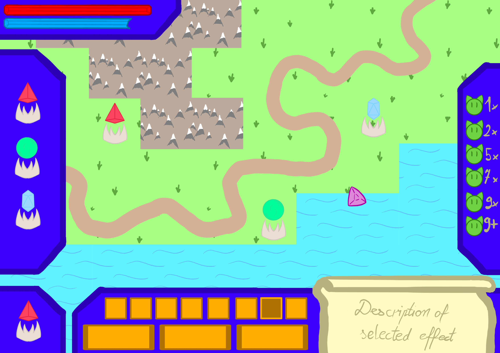

# Game design document
## [Nazwa gry]

### Setting

*Gracz zostaje wprowadzony poprzez przewijający się tekst w stylu Star Wars'ów*

Jesteś alchemikiem poszukującym Kamienia Filozoficznego. Po wielu latach eksperymentów znalazłeś sposób na jego utworzenie. Niestety, w trakcie jego tworzenia zostałeś zaatakowany przez swojego rywala - nadwornego czarodzieja parającego się czarną magią. Wybrakowany Kamień Filozoficzny wybucha, powodując wymieszanie i destabilizację żywiołów oraz innych elementów tworzących wszechświat. Dzięki temu twój rywal może użyć nekromancji do kontrolowania nie tylko nieumarłych, ale i inne stworzenia, rozpoczynając jego plan przejęcia władzy nad światem. Po zebraniu fragmentów Kamienia Filozoficznego postanawiasz za ich użyciem powstrzymać szalonego maga i uratować świat. 

### Styl graficzny

1. Oprawa graficzna będzie stylizowana jako rysunki (stickman). Obiekty będą obrysowane wyraźną kreską znaczącej grubości, z jaskrawymi kolorami oraz limitowaną paletą barw

2. Przyciski, panele oraz pomniejsze elementy bliskie figurom geometrycznym będą stylizowane na kamienie szlachetne

3. Pozostałe elementy UI będą głównie utworzone z biżuterii, bądź złotych/srebrnych mocowań. Alternatywą są części które mogłyby się znaleźć w laboratorium fantastycznego alchemika.

4. Postacie będą składały się z dużej głowy, często zdominowanej przez charakterystyczny element (kapelusz maga, czaszka, elfie uszy, itp.), wąskiego korpusu oraz kończyn w postaci grubych kresek

### Idea gry/main gameplay loop

Celem gracza jest nie dopuszczenie aby przeciwnicy zniszczyli kamień filozoficzny. Gracz będzie miał możliwość budowania wież które będą wspierać go w obronie kamienia. Wieże będzie można modyfikować za pomocą kryształów, które pozwolą na całkowitą zmianę działania wież i wyzwolenie ich maksymalnego potencjału.

### Interface

* lewy górny róg - pasek hp bazy głównej oraz pasek mp do tworzenia wież
* lewy bok - panel wież możliwych do zbudowania
* lewy dolny róg - obecnie wybrana wieżyczka/przeciwnik
* dolny bok - efekty posiadane przez wieżę, statystyki oraz krótki opis podświetlonego efektu
* prawy bok - lista nadchodzących fal

### Opis mechanik

1. Postać Gracza - Gracz będzie sterować alchemikiem, który będzię mógł poruszać się po mapie i budować wieżę poprzez wybranie odpowiedniej wieży z menu i postawienie jej w wybranym dozwolonym miejscu. Oprócz tego będzie mógł sam strzelać w przeciwników.

2. Cel obrony - Cele gracze jest nie dopuszczenie aby punkty zdrowia celu spadły do zera.

3. Przeciwnicy - Przeciwnicy będą pojawiać się w wyznaczonym miejscu będą oni szukali sposobu aby dotrzeć do celu obrony i próbowali go zniszczyć. Jeżeli dojście do celu będzie nie możliwe z powodu zastawionych wież przeciwnicy będą niszczyć struktury gracza aby iść dalej. Przeciwnicy i ich zdolności będą losowo generowane i regularnie pojawiać się w falach. Przeciwnicy będą mieli 3 sposoby poruszania się:

* lądowe - poruszające się lądem
* wodne - poruszające się lądem ale też mogące pokonywać przeszkody wodne
* powietrzne - przelatują nad wieżami

4. Fale - Przed falą gracz będzie miał czas aby przygotować obronę. Gracz ma możliwość przyspieszyć wystąpienie fali. Gracz będzie atakowany przez hordy przeciwników. Kiedy gracz wybije wszystkich przeciwników fala zakończy się i gracz otrzyma nagrodę w postaci kart ulepszeń. Gracz wygrywa kiedy pokona 20 falę i następnie ma możliwość kontynuowania gry w trybie nieskończonym. Z każdą falą pojawiają się coraz silniejsi przeciwnicy

5. Złoto - Zabicie przeciwnika będzie generowało złoto za które będzie można naprawiać, budować lub ulepszać wieże

6. Wieże - Posiadają zasięg i atakują przeciwnika skupiając się na jednym celu dopóki jest w zasięgu. Mogą zostać zburzone przez przeciwników.

7. Statusy - Różni przeciwnicy będą mieli podatność lub odporność na wybrane statusy. Kombinacje statusów będą zmienne dla różnych rozgrywek co będzie zmuszać gracza do eksperymentowania. Kombinacje statusów będą także generować różne reakcje np. dodatkowe obrażenia w czasie, spowolnienie przeciwnika itd.

8. Kryształy - Służą do ulepszania wież lub postaci gracza. Efekty kart są losowane i mogą wpływać na zmianę działania wieży. Ulepszenia mają na siebie wpływ dlatego łącząc je można uzyskiwać nowe statusy, różne szablony ataków itd.

10. Wydarzenia - Po kilku falach będą występować losowe wydarzenia, w których gracz będzie mógł np. zniszczyć 2 wieże aby połączyć je w 1 lepszą.

### Odniesienia i inspiracje

* Gemcraft - Gracz wciela się w czarodzieja który tworzy kryształy i umieszcza je w wieżach
* Patapon - Wygląd postaci składa się z wielkiej głowy oraz kończyn w postaci grubych
* Ember Ward - Mechanika dynamicznego modyfikownia ścieżki poprzez stawianie wież oraz bloków co zmusza przeciwników do podjęcia innej okrężnej drogi.
* Kingdom Rush - Tower Defence w którym oprócz wieżyczek używany jest również bohater którym steruje gracz.